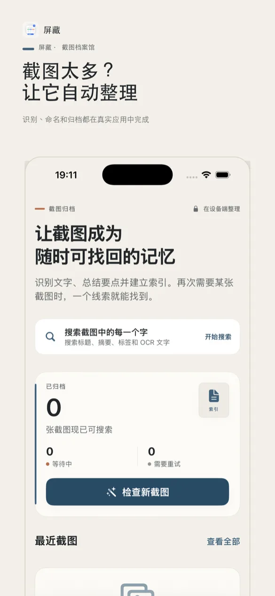
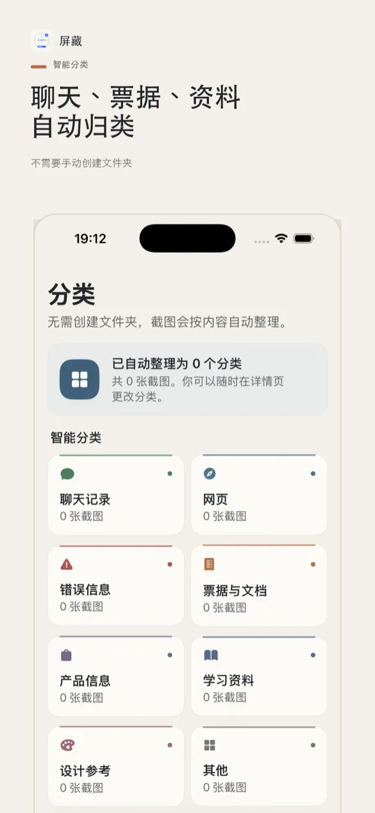
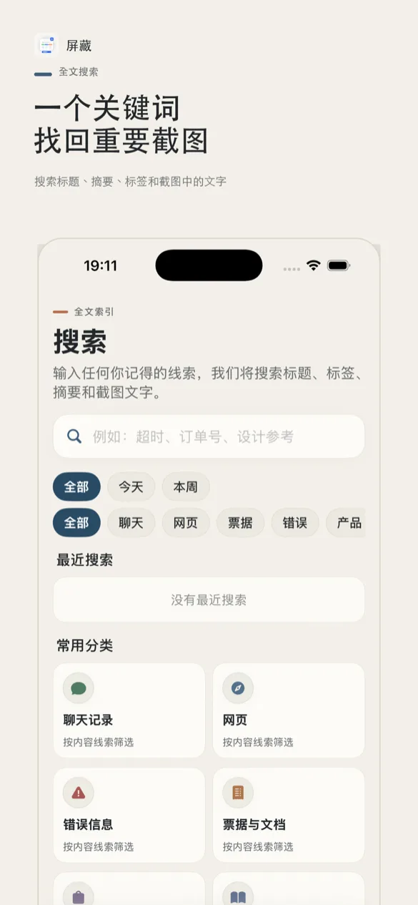
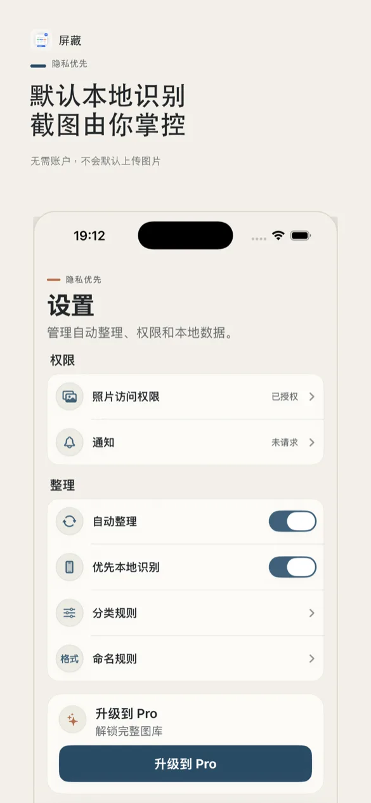

# ScreenTrove Website

ScreenTrove（简体中文名“屏藏”）的官方网站，包含产品介绍、隐私政策与使用条款。

访问：[https://mrleedynasty.com/](https://mrleedynasty.com/)

## 预览

| 自动整理 | 自动分类 | 文字搜索 | 隐私优先 |
| --- | --- | --- | --- |
|  |  |  |  |

## 本地预览

需要 Node.js 20 或更高版本。

```bash
npm run dev
```

打开 `http://localhost:4173`。

## 构建与测试

```bash
npm run build
npm test
```

## App Store

屏藏：截图整理与搜索（ScreenTrove）

https://apps.apple.com/cn/app/id6782530093
